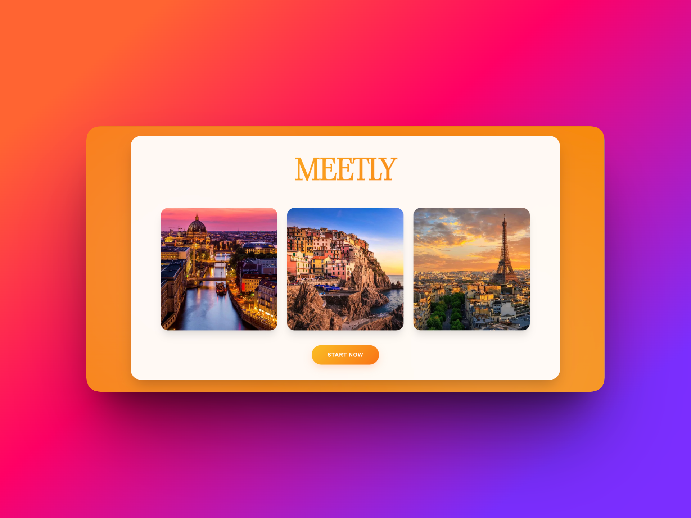
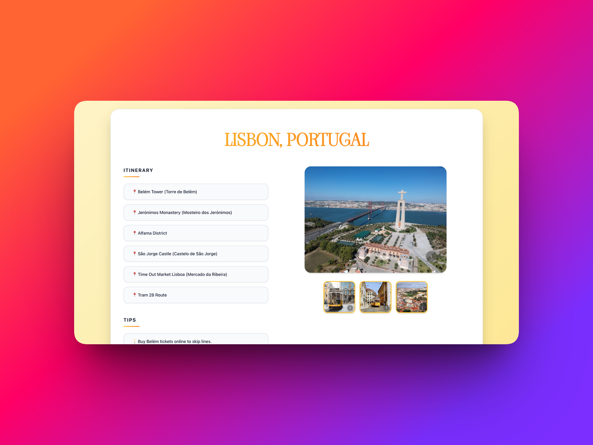
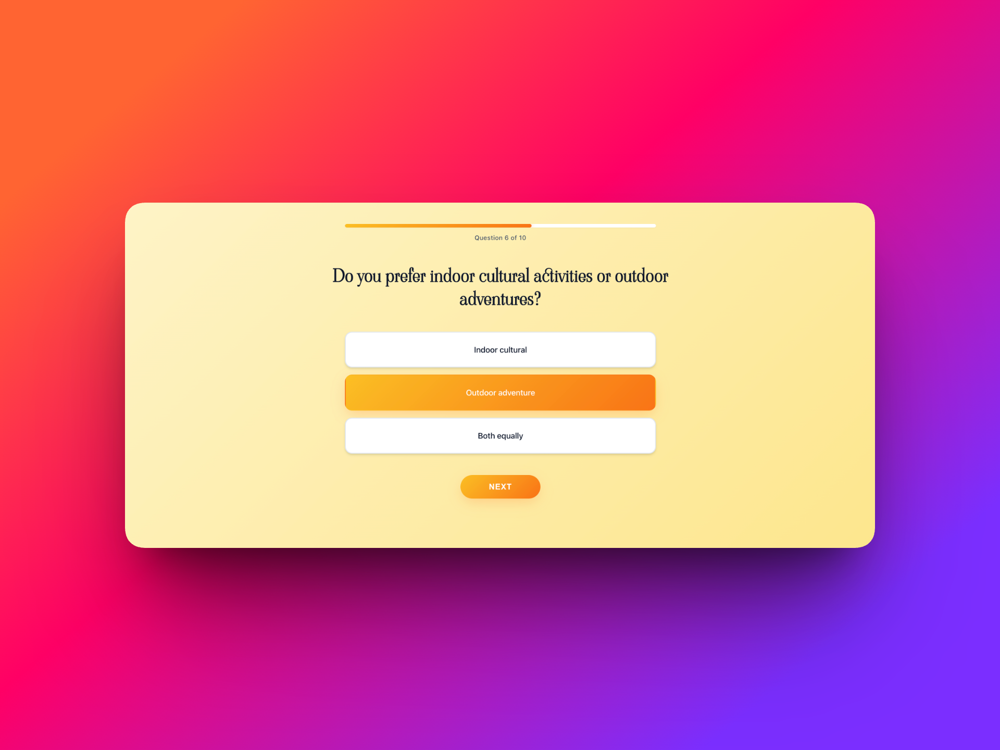

<div align="center">
   

   <h1>Meetly</h1>

   
   
   
   
   
   
</div>


Check it out here: [Official Website](https://meetly-web.vercel.app)!

## **Connect with the world through personalized travel exploration**

Meetly is a web application that connects people from diverse backgrounds through personalized travel exploration and planning. Using intelligent surveys and AI integration, we create the perfect travel itinerary tailored to your unique needs and preferences.



## Table Of Contents
1. [🌍 Inspiration](#-inspiration)
2. [✨ Features](#-features)
3. [🔄 How It Works](#-how-it-works)
4. [🛠️ Tech Stack](#%ef%b8%8f-tech-stack)
5. [📋 Prerequisites](#-prerequisites)
6. [🚀 Installation](#-installation)
7. [🖥️ Usage](#-usage)
8. [🐛 Troubleshooting](#-troubleshooting)
9. [🤝 Contributing](#-contributing)


## 🌍 Inspiration

Virtual connections, such as video calls and online chats, can never replace the experience of truly traveling somewhere and meeting people from different backgrounds face to face. We were inspired to build this project to encourage real-world interaction and help people actually go out, explore new places, and connect with others in meaningful ways.

## ✨ Features

- **Personalized Travel Recommendations**: Get location suggestions based on your preferences, interests, and comfort levels
- **AI-Powered Itinerary Generation**: Automatically generated travel plans with detailed place recommendations
- **Cultural Interaction Tips**: Receive helpful, concise tips on how to interact with people in your recommended destination
- **Beautiful Image Galleries**: Stunning location photography powered by Unsplash
- **Interactive Quiz Interface**: Answer 10 thoughtfully designed questions about your travel preferences
- **Progress Tracking**: Real-time loading screen with progress indicators during AI processing
- **Responsive Design**: Modern, user-friendly interface that works across devices
  


## 🔄 How It Works

1. **Landing Page**: Users are welcomed with an attractive landing page showcasing travel destinations
2. **Interactive Quiz**: Users answer 10 questions covering:
   - Travel preferences (food, nature, museums, nightlife)
   - Social interaction comfort levels
   - Planning style (structured vs. spontaneous)
   - Interest in landmarks vs. hidden gems
   - Travel pace preferences
   - Activity preferences (indoor vs. outdoor)
   - Food experience preferences
   - Ideal settings (urban, coastal, mountains, rural)
   - Budget considerations
   - Openness to new experiences
3. **AI Processing**: The application uses Google Gemini AI to:
   - Analyze user responses
   - Generate a personalized destination recommendation
   - Create a detailed itinerary with multiple locations
   - Provide concise cultural interaction tips
4. **Image Fetching**: Unsplash API provides beautiful, relevant images of the destination
5. **Results Display**: Users see their personalized recommendation with:
   - Destination name
   - Curated itinerary with locations and addresses
   - Practical tips for cultural interaction
   - Stunning photo gallery
     


## 🛠️ Tech Stack

### Frontend
- **React** 19.2.0 - Modern UI library
- **Vite** 7.2.2 - Fast build tool and development server
- **Vercel** - Fast web deployment and serverless API integration

### Backend
- **Node.js** - Serverless API functions
- **Google Gemini AI** (gemini-flash-lite-latest) - AI-powered location and itinerary generation
- **Unsplash API** - High-quality travel photography

## 📋 Prerequisites

Before you begin, ensure you have the following installed:

- **Node.js** (LTS version recommended) - [Download Node.js](https://nodejs.org/)
- **npm** or **yarn** package manager
- **Google Gemini API Key** - [Get your API key](https://ai.google.dev/)
- **Unsplash API Access Key** - [Get your access key](https://unsplash.com/developers)

## 🚀 Installation

1. **Clone the repository**
   ```bash
   git clone <repository-url>
   cd Meetly
   ```

2. **Install dependencies**
   ```bash
   npm install
   ```

3. **Set up environment variables**
   
   Create a `.env` file in the root directory and add your API keys:
   ```env
   GEMINI_API_KEY=your_gemini_api_key_here
   UNSPLASH_ACCESS_KEY=your_unsplash_access_key_here
   ```

   > **Note**: For serverless deployments (like Vercel or Netlify), add these environment variables in your platform's dashboard instead of a local `.env` file.

## 🔑 Obtaining API Keys

### Google Gemini API Key

1. Visit [Google AI Studio](https://ai.google.dev/)
2. Sign in with your Google account
3. Navigate to "Get API Key" in the left sidebar
4. Create a new API key or use an existing one
5. Copy the key and add it to your environment variables

### Unsplash API Access Key

1. Visit [Unsplash Developers](https://unsplash.com/developers)
2. Create a developer account or sign in
3. Create a new application
4. Copy your Access Key from the application dashboard
5. Add it to your environment variables

## 💻 Usage

### Development Server

Start the development server with hot-reload:

```bash
npm run dev
```

The application will be available at `http://localhost:5173` (or the next available port).

### Development Server (Network Access)

To access the app from other devices on your network:

```bash
npm run dev-host
```

### Build for Production

Create an optimized production build:

```bash
npm run build
```

The built files will be in the `dist/` directory.

### Preview Production Build

Preview the production build locally:

```bash
npm run preview
```

### Linting

Check code quality and style:

```bash
npm run lint
```

## 🐛 Troubleshooting

### API Key Issues

**Error: "Gemini API key missing" or "Unsplash API key missing"**
- Ensure your `.env` file is in the root directory
- Verify the environment variable names are exactly `GEMINI_API_KEY` and `UNSPLASH_ACCESS_KEY`
- For serverless deployments, check that environment variables are set in your platform's dashboard
- Restart your development server after adding environment variables

### Build Issues

**Error during `npm run build`**
- Clear `node_modules` and reinstall: `rm -rf node_modules package-lock.json && npm install`
- Ensure you're using a compatible Node.js version (LTS recommended)

### CORS Issues

If you encounter CORS errors when calling API endpoints:
- Ensure your API endpoints are properly configured for your deployment platform
- Check that your serverless function handlers are correctly exported

## 🤝 Contributing

Contributions are welcome! If you'd like to contribute to Meetly:

1. Fork the repository
2. Create a feature branch (`git checkout -b feature/amazing-feature`)
3. Commit your changes (`git commit -m 'Add some amazing feature'`)
4. Push to the branch (`git push origin feature/amazing-feature`)
5. Open a Pull Request

Please ensure your code follows the existing style and passes linting checks.

## 👥 Credits

Created by **Parteek Deol** and **Kushaagra Patel**

---

**Happy Travels! 🌎✈️**

